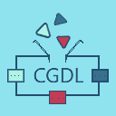

<h1>Common Game Development Library</h1>

## Glossary
 * module separate part of CGDL source code presented via folder in 'source' folder.
 But all modules are depended on 'shared' module.
 
## Directories

 - **source/** - Source code of the CGDL;
 
   - ***memory/*** - memory allocation functional;
 
   - ***test/*** - code for testing CGDL (for CGDL developers only);
 
   - ***shared/*** - code used by all other CGDL modules.

   
## Usage
You need include 'shared' module in your project necessarily. Other modules are optional.
Don't include 'test' in your project until you want debug CGDL or code based on it seriously!